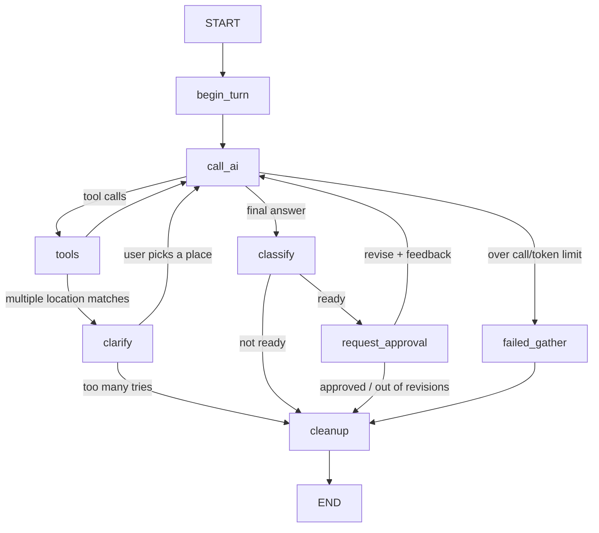

# Holidai 🏖️

Holidai is an AI trip-planning agent. Tell it where and when you're going, and it looks up the real weather forecast, local events and nearby attractions, then drafts a short vacation plan for you to approve or tweak.

**Live demo:** [add your link here](https://your-app-url)

## Run it yourself

You'll need Python 3.11+, an [OpenAI API key](https://platform.openai.com/api-keys) and a free [Ticketmaster API key](https://developer.ticketmaster.com/).

```bash
git clone https://github.com/amrevvagrahb/holidai.git
cd holidai

python -m venv .venv
source .venv/bin/activate        # Windows: .venv\Scripts\activate
pip install -r requirements.txt

cp .env.example .env             # then add your two API keys
streamlit run ui.py
```

## How it works



## Roadmap

- [ ] Evaluation set for plan quality and tool-use accuracy
- [ ] Tracing with LangSmith
- [ ] Streaming the draft as it's written
- [ ] More tools (flights, hotels, currency)